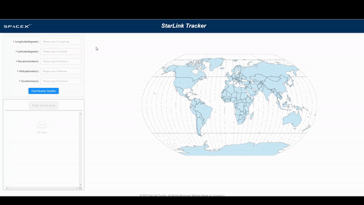

# Starlink-Tracking

• Designed and developed a visualization dashboard using ReactJS and Ant Design components.

• Created a refined satellite search based on longitude, latitude.

• Used promise-based HTTP client Axios to fetch location data from n2yo.com.

• Animated selected satellite paths on a world map using D3 to improve visualization.

